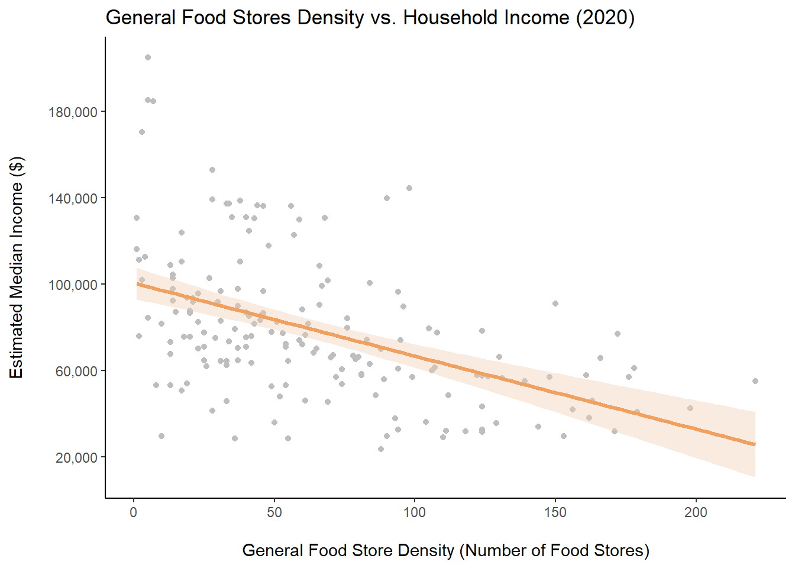
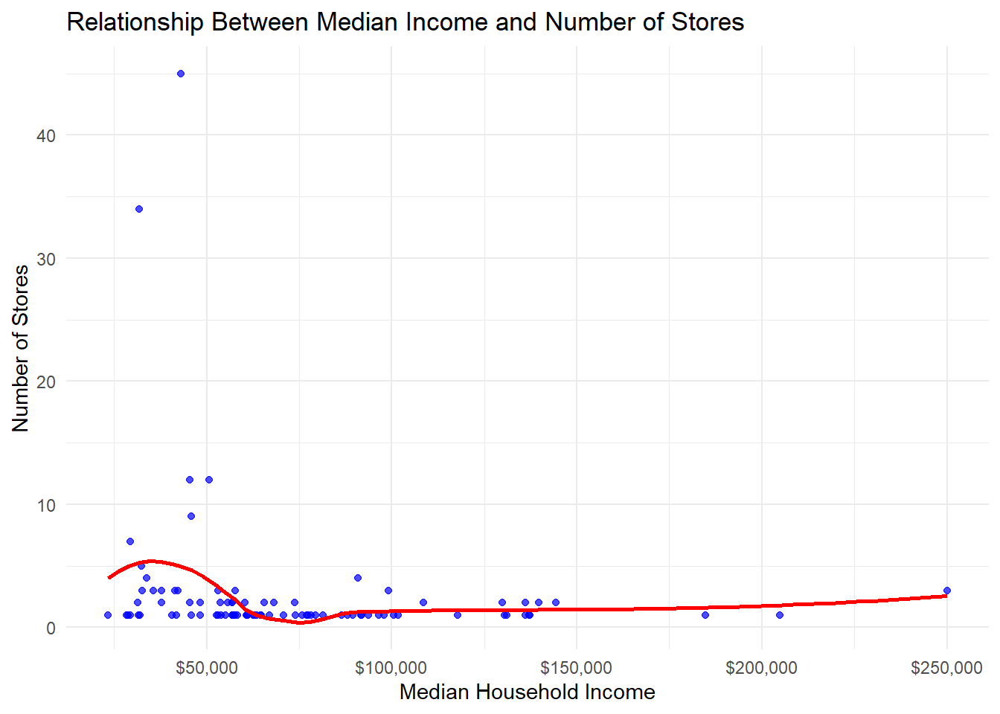

```{r setup, include=FALSE}
knitr::opts_chunk$set(collapse = TRUE, message = FALSE)
```

*Zhiyu Wei (zw2975), Carolina Montes Garcia (cm3341), KK Chen (tc3326), Fang Wang (fw2394), Sonum (Sony) Siddalingaiah (scs2267)*

<br>

## Motivation

Nearly 1.3 million New Yorkers are experiencing food insecurity. Many of these individuals not only experience lack of food availability, but lack of access to nutritious and healthy food. Food insecure households consistently report decreased fruit and vegetable intake, as there are few options available at their local grocery stores and bodegas for affordable produce. As such, food insecure individuals were 15.3% more likely to develop chronic diseases such as coronary heart disease, hypertension, and obesity.

<br>

As public health professionals who are passionate about addressing health disparities, we wanted to explore the relationship between social determinants, food access, and diet-related health outcomes. The goal of our project was to examine associations between household income, walkability, overweight, and food store locations in New York City. We analyzed these associations for both regular retail food stores and healthy food stores to identify if there were differences in store availability and health outcomes between stores with healthier options and stores without healthy options. Through our project, we aimed to provide a nuanced picture of food access in New York City.

<br><br>

## Related work

This project was inspired by Sony’s APEx (practicum) with [City Harvest](https://www.cityharvest.org/), a non-profit organization that provides access to healthy produce for low-income New Yorkers. Through her work, Sony saw how the populations City Harvest served were reliant on their bi-weekly mobile markets because they lacked access to affordable healthy food options. Many simply had few grocery stores near their homes or had limited access to healthy food at available stores. Having consistent access to produce within their neighborhood was crucial for helping these clients manage chronic diseases and maintain their health. Inspired by Sony’s work, our team decided to put our public health skills to the task and examine the intersection between social determinants, accessibility of stores, and chronic disease outcomes.

<br><br>

## Initial questions

We began by brainstorming some initial questions to guide data cleaning and merging:

1. How accessible are healthy food stores?

    a. Are they within a walkable distance?
    b. How far are they from subway stations, and how many subway stations are within a walkable distance?
    c. How concentrated are they in each neighborhood?
    

2. How does the quality of food vary across stores in different neighborhoods?  

3. How do standard grocery prices (e.g., bread, milk, eggs) differ between neighborhoods?  

4. How does the density of healthy food stores compare to the overweight and diabetes rate in each borough？ 

<br>

Due to the limitations of our datasets and the need for coherence with the general research question, we modified our questions to be:

1. What is the association between density (number of stores) of general food stores/healthy food stores and median household income in NYC?

2. Is the density (number of stores) of general retail food stores/ healthy stores associated with the percentage of overweight individuals by borough? 

3. What is the walking distance from the subway to the groceries?

4. What was the impact of the pandemic on food store density in NYC?

<br><br>

## Data

The data cleaning process was extensive and can be found [here](https://bublygudo.github.io/team_project.github.io/data_cleaning.html).

The pattern we followed for all data cleaning was merging the predictor and outcome datasets (eg. Retail_Food_Store_clean.csv with Percentage Overweight by Borough.csv).

<br><br>

## Exploratory Data Analysis

<br>

### Maps 

#### [Landing Page](https://bublygudo.github.io/team_project.github.io/index.html)

1. Interactive map on landing page is to provide an intuitive visual representation of the geographic distribution of healthy stores, retail stores, and farmer markets across NYC. The interactive map was created using the leaflet package.

2. The map uses CartoDB.Positron tiles background with adjusted transparency (opacity = 0.8) for clarity and aesthetic appeal. Each type of food sources was given a unique color for easy differentiation. Each marker displays detailed information (store name, borough, address, and type) when clicked. Color-coded markers and detailed popups make it easy to identify and explore the locations of different food sources. The use of an interactive map ensures that stakeholders can explore the data in an intuitive, spatial format.

3. The map allows users to observe clustering patterns and disparities in access to food-related resources.

<br>

#### Leaflet Map

Map of number of healthy food stores by zip code in the four main boroughs of NYC (Manhattan, Brooklyn, Bronx, and Queens) and median income.

<br>

### Plots

#### [Walking Distance](https://bublygudo.github.io/team_project.github.io/walkability_summary.html)

##### Scatterplot - Walking Distance Per Zip Code By Borough

The dataset for all food stores was combined with the longitudes and latitudes from the subway stations dataset, and we manually entered the zip codes for each store. This was saved in a dataframe called store_zip. The walking distances between the subway stations and food stores were determined using distHaversine(), a function in the geosphere package that uses longitude and latitude to calculate the distance between specified points. We calculated the average distance from subway to stores per zip code, and used ggplotly to create the scatterplot. This plot was faceted by borough to show if average distance to subway per zip code differed between boroughs.

<br>

##### Boxplot - Average Walking Distances in Zip Codes by Borough

  This box plot was created to further visualize the differences in distribution by borough for the average distance from stores to subway by zipcode. We used data from store_zip and created a box plot using plotly. This box plot helped us identify outliers and see how the walking distances varied within each borough. 

<br>

##### Bar Graph - Average Walking Time in Zip Code in Borough

  This bar graph was created to provide a more tangible visual to our site visitors on the amount of time it takes to travel from subway stations to food stores in each borough. We found that it takes a person, on average, 1.4 seconds to walk a meter, and we used this to calculate a “time” variable for the number of minutes it would take an average person to walk from subway stations to food stores. We used plotly to create a bar graph with the average walking time for each borough, and compare these results. 

<br>

##### Bar Graph - Average Walking Time in Zip Code in Borough for Retail Food Stores and Healthy Food Stores

  This bar graph was created to expand upon our previous plot to determine if there were differences in average walking time per borough between regular “retail” food stores and healthy food stores. We used our store_zip data frame with the calculated time variable and created a bar graph in ggplotly that faceted the results by borough.  

<br>


#### Store Density

<br>


1. This Bar graph was created to compare the number of healthy stores and farmer markets across NYC boroughs. A grouped bar plot was used to summarize and display the total number of food sources in each borough.

2. Data was grouped by borough and the counts were summed using sum(count, na.rm = TRUE). X-axis: Boroughs were set as the independent variable. Y-axis: Total counts of healthy stores and farmer markets. Fill Color: Borough-specific colors were used for visual differentiation.

3. A bar plot is intuitive for comparing discrete categories (boroughs) and their respective totals.This plot highlights boroughs with the highest and lowest access to healthy stores and farmer markets, emphasizing disparities in resource distribution.

<br>

#### Store Density Change Due to Pandemic

<br>


This bar graph effectively visualizes changes in healthy food store density across boroughs before and after the pandemic. This comparison highlights boroughs with significant increases or decreases in store numbers, providing an initial understanding of the pandemic’s potential impact and guiding the direction for subsequent statistical analysis, such as a t-test.

<br>

#### Overweight Percentage Change

<br>


1. A scatter plot with loess smoothing lines for each borough was used to display trends. Excluded data for 2023 (filter(year != 2023)) due to incomplete or anomalous data for this year. X-axis: Treated year as a continuous variable (as.numeric(year)) to show trends over time. Displayed all years explicitly using scale_x_continuous() with unique labels for readability. Y-axis: Represented overweight_percentage as the dependent variable. Points and Smoothing Lines: Points: Represent individual borough-year overweight percentages. Smoothing Lines: Added loess (local regression) smoothing to highlight trends for each borough without assuming linearity. Each borough was given a distinct color for differentiation in the visualization.

2. Scatter plots with smoothing lines are effective for visualizing trends over time, particularly when the relationships may not be linear.

<br>

#### Linear Regression: Number of retail food store/ healthy food stores vs. percentage overweight by boroughs and Household Income vs. store Density of Healthy Food Stores/ Retail Food Stores

<br>

<div style="display: flex; justify-content: space-around;">
  
  
</div>

<br>

<div style="display: flex; justify-content: space-around;">
  
  
</div>

<br>

1. linear regression was performed to model the relationship between the specific variables of the models we used. The regression results provided insights into the strength and direction of the relationship. Scatter plots were also created to visualize the data points and the fitted regression line, offering clear graphical representations of trends.

2. To ensure the appropriateness of linear regression for each dataset, assumption checks were carried out:

  a. Normality: Residuals were evaluated using QQ plots. Deviations from normality were noted.

  b. Homoscedasticity: Residuals vs. fitted values plot and the Breusch-Pagan test were used to check for equal variance of residuals.
    
  c. Linearity: The RESET test were used to verify the linearity assumption.
    
<br><br>

## Additional Data Analysis

*Given that not all assumptions of linear regression were satisfied, a Spearman’s rank correlation test was conducted as a non-parametric alternative. This test does not require the assumptions of normality and linearity and is appropriate for data that may have monotonic but non-linear relationships.*

<br>

### Spearman's Rank Test: Household Income vs. store Density of Healthy Food Stores/ Retail Food Stores and Household Income vs. store Density of Healthy Food Stores/ Retail Food Stores

<br>

<div style="display: flex; justify-content: space-around;">
  
  
</div>

<br>

<div style="display: flex; justify-content: space-around;">
  
  
</div>

<br>

Non-linear regression plots were generated to visualize the trends suggested by the data points, providing a clearer depiction of the relationships and improving the interpretation of the tested models.


<br>

### T-test: Pandemic Impact on Grocery Store Density by Borough

To evaluate the impact of the pandemic on grocery store numbers, a t-test was conducted to compare the number of stores before and after the pandemic, determining whether the observed changes were statistically significant.


<br><br>


## Discussion

For our two analyses of the relationship between household income and food store availability, our outcomes contradicted what we expected to find. The results for our Spearman’s rank tests for both retail food stores and healthy food stores indicated that there were significant negative associations between store density per zip code and household income. This suggests that zip codes with lower household incomes had higher densities of retail and healthy food stores. Our leaflet map confirmed this association, as it displays several areas that are not high income where there are high densities of retail and healthy food stores. We believe that one potential explanation for this association is that programming to increase food access has effectively increased the number of stores available in low-income communities. However, there may also be additional confounding factors, such as population density and access to transportation, that may also have caused this association.  

<br>

Our initial EDA bar graph of healthy food stores in each borough found that Brooklyn had the highest number of healthy food stores, and Staten Island had the lowest number of healthy food stores. Our two analyses of percent overweight per zip code by number of food stores have yielded mixed results. The Spearman’s test on percent overweight by number of retail food stores indicates a significant positive relationship between percent overweight by zip code and number of retail food stores. This result is consistent with our knowledge of chronic disease outcomes and food access, as increased access to general food stores may increase rates of overweight if these stores contain fewer healthy options and more calorie dense foods. However, our second Spearman’s test found that there was not a significant association between healthy food stores and percent overweight by zip code. This indicates that rates of overweight does not differ substantially based on access to healthy food stores. There are potential confounders to be explored, such as daily physical activity and neighborhood walkability, which may have influenced this association. However, we can also consider the possibility that perhaps healthy stores are not as effective of an intervention as we initially perceived. Future research can provide more detailed metrics on the quality of food at farmers markets and healthy food stores, as well as how many people within these zip codes are actually purchasing produce from these stores. 

<br>

We conducted a two-sample t-test to see if the pandemic influenced the number of healthy food stores available. Our reasoning was that potential store closures during the pandemic may have impacted the number of healthy food stores and farmers markets that were able to stay open. However, our test found that there was not a significant difference in number of healthy food stores pre and post-pandemic. We conjecture that perhaps many of these stores were able to stay open through the pandemic, or that additional stores may have opened as restrictions were relaxed. 

<br>

Through our visualizations of average walking distance and average walking time from subway stations to stores, we found that Manhattan appeared to have significantly lower walking distances and walking times in comparison to Brooklyn, Queens, and the Bronx. We found that there were no significant overall changes in walking distance between retail and healthy food stores in each borough, indicating that there are not significant borough-level disparities. However, when we examined the zip codes with the five highest and lowest walking distances, we found that most of the zip codes with the lowest walking distances were concentrated in Manhattan, and most of the zip codes with the highest walking distances were concentrated in the Bronx. We believe that this disparity may be due to higher numbers of subway stations in Manhattan in comparison to the Bronx. We also found that several of the zip codes with the highest and lowest walking distances were located in Brooklyn, which may indicate that there is high disparity in walking distances among Brooklyn neighborhoods.

<br>

Based on all of our results, it is clear that further analysis is needed to understand relationships between food access, social determinants, and chronic health outcomes. Many of our results contradicted our initial perceptions of these relationships, such as the negative association between household income and food store availability and the lack of significance for the association between percent overweight and availability of healthy stores. As such, we believe that further efforts are needed to explore other explanations for why we may have found these results. We suggest that subsequent research on healthy food access in New York City be directed towards:

  1. Examining the efficacy of healthy food store interventions in reducing chronic disease outcomes
    
  2. Examining the efficacy of the city’s programming in increasing availability of healthy stores in low-income zip codes
    
  3. Examining disparities between zip codes in accessing food stores by public transportation
   
<br>
 
We hope that our project can serve as a foundation for future work to understand the complexities of how healthy food access impacts the health and well being of marginalized communities. 


<br><br>

## Reference

1. [USDA: Food Insecurity, Chronic Disease, and Health Among Working-Age Adults](https://www.ers.usda.gov/webdocs/publications/84467/err-235.pdf) 

